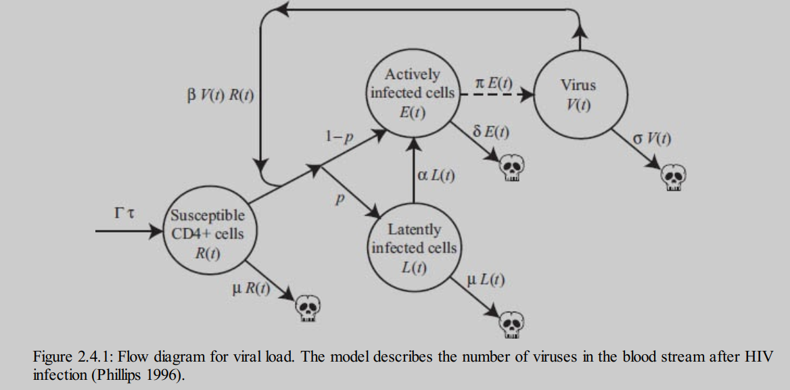

```{r setup, include=FALSE}
knitr::opts_chunk$set(echo = TRUE)
library(deSolve)
library(magrittr)
library(dplyr)
library(patchwork)
library(ggplot2)
```

## Abstract

After infection with the human immunodeficiency virus (HIV), the concentration of the virus in the person's plasma increases. The subsequent decrease in concentration a few weeks later was though to result from an HIV-specific immune response. This purported causal relation is investigated with a model of the dynamics of early HIV infection that incorporates no increase in the rate of removal of free virions or virus-infected cells. A pattern of changes in virus concentration similar to that observed in patients is predicted by the model. Thus, the reduction in virus concentration during acute infection may not reflect the ability of the HIV-specific immune response to control virus replication.




## The Model

```{r}
# Timestep
t <- seq(0,120, by = 1)

# Variables
cells <- c(R = 200, 
           L = 0,
           V = 4e-07, 
           E = 0)

# Model parameters
params <- c(gamma = 1.36, 
            mu  = 0.00136, 
            tau  = 0.2, 
            beta = 0.00027,
            rho  = 0.1, 
            alpha = 0.036, 
            sigma = 2,
            delta  = 0.33,
            phi = 100)

# Equations
source("R/phillips_1996_viral_load.R")

# Solve the equations
s_CD4_HIV_dynamics_solution <-
  ode(
    y = cells,
    times = t,
    func = viral_load,
    parms = params,
    method = "euler") %>%
  as.data.frame()

# load the plotting functions
source("R/phillips_1996_viz.R")

# produce plots
Rplot + VLEplot
```

